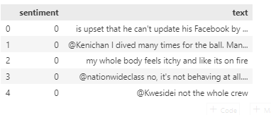
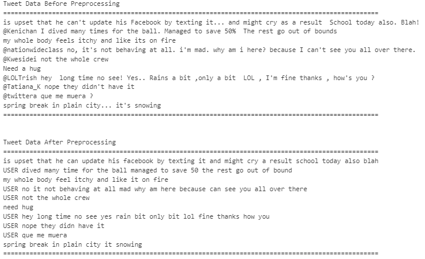
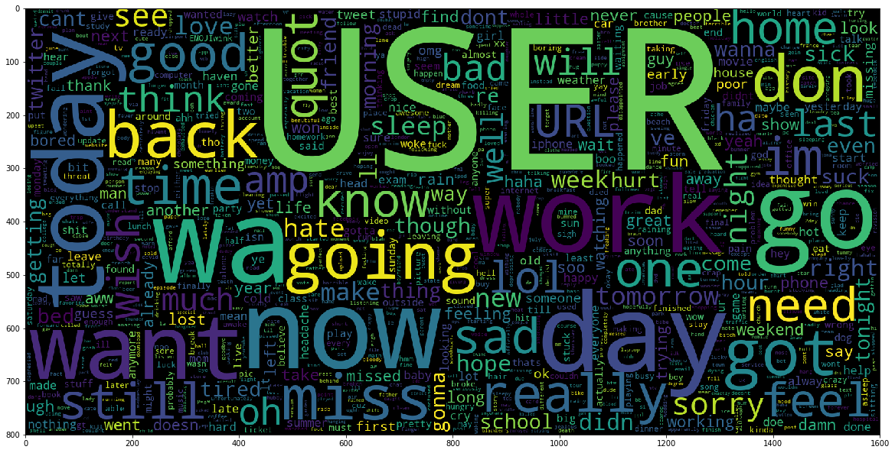
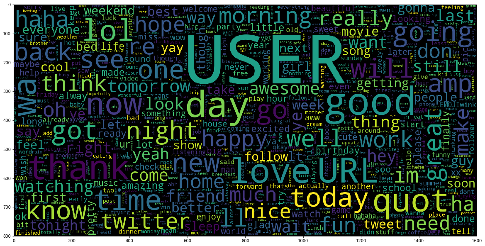
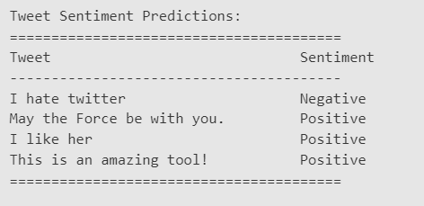

# Introduction

In this project, we explore sentiment analysis, a powerful tool for understanding people's emotions and opinions in text. Our focus is on Twitter data, where users express their feelings on various topics. The goal is to build a machine learning model that can accurately predict whether a tweet's sentiment is positive or negative. 

To  achieve  this,  we  preprocess  the  tweets,  removing  unnecessary  elements  like  URLs  and usernames, and converting words to their base forms. We then use TF-IDF to create meaningful feature vectors representing the importance of each word. 

We'll compare the performance of different machine learning algorithms, such as Naive Bayes, Support Vector Machines (SVM), and Logistic Regression, to find the best model. By evaluating accuracy, precision, recall, and F1-score, we aim to achieve reliable sentiment analysis results. 

# Data Collection

We gathered our data from Kaggle, a reliable platform for accessing datasets. The dataset was specifically designed for sentiment analysis, containing a variety of tweets with positive and negative sentiments. Kaggle ensures data quality and relevance, saving us time on data collection and cleaning. 

By using this pre-processed dataset, we could concentrate on model development and analysis without worrying about data complexities or user privacy. It provided a solid starting point for our sentiment analysis project. 

|  |
|:--:|
| <i>Figure 1 Data Set Sample 
</i>|

# Methodology

## Data Preprocessing

During the data preprocessing phase, we took several important steps to ensure the text data's quality and relevance for sentiment analysis. These steps involved carefully cleaning and refining the text to create a more meaningful and informative dataset. Here is the each of these steps: 

1. Removing Stop Words: In this step, we got rid of common and non-informative words like "the," "is," "and," and others that don't carry much sentiment-related meaning. These words often appear frequently in text but do not provide much information to the sentiment analysis process. 
1. Removing Special Characters: Special characters and punctuations were eliminated to ensure that the text is as clean and clear as possible. Removing unnecessary characters helps us focus on the essential content and prevents potential confusion during analysis. 
1. Removing URLs: Since URLs or web links are not relevant to sentiment analysis, we replaced them with the word "URL."  
1. Removing Mentions(User ID): User mentions, such as "@username," were replaced with the word "USER." While mentions are essential for communication on social media, they are not significant in determining sentiment, so removing them helps us focus on the actual content. 
1. Removing Hashtags: Hashtags like "#sentimentanalysis" were  excluded from the text during preprocessing. While hashtags are vital for categorizing and indexing social media content, they are not relevant to sentiment analysis, and excluding them improves the accuracy of our sentiment predictions. 

|  |
|:--:|
| <i>Figure 2 Data set after preprocessing 
</i>|

After preprocessing our data, we created word clouds to visualize the most frequent words in both negative and positive tweets. Word clouds are graphical representations that display the most commonly occurring words in a dataset, with word size indicating frequency. 

**Word Cloud for Negative Sentiments:** 

Negative word like “bad”, “suck”, “sad” etc are shown on the word cloud picture.  

|  |
|:--:|
| <i>
Figure 3 Word Cloud based on Negative Tweet  
</i>|

**Word Cloud for Positive Sentiments:** 

Positive  Words  like  "love,"  "happy,"  "good,"  and  "great"  are  shown  in  the  word  cloud. 

|  |
|:--:|
| <i>
Figure 4 Word Cloud based on Negative Tweet  
</i>| 

## Feature Extraction 

During the feature extraction phase, we use **TfidfVectorizer** to convert preprocessed tweets into numerical values, allowing our sentiment analysis models to understand and predict sentiments accurately. It calculates word importance based on frequency and uniqueness across the dataset. This transformation is crucial for an effective sentiment analysis system. 

## Results

**SVM:** In SVM model, we  have got 90% on training while 81% on testing data set.  
**Linear Regression (LR):** In LR model, we got 85 on  training while 82 on testing.  
**Naive Bayes:** In Naïve Bayes model 82% and 80% for training and testing respectively.  

||**Training Accuracy** |**Testing  Accuracy** |
| :- | - | - |
|**SVM Model** |90% |81% |
|**Naive Bayes Model** |82% |80% |
|**Logistic Regression** |85% |82% |

|  |
|:--:|
| <i>
Figure 5 Prediction on unseen data set.
</i>| 
 

## Model Evaluation

In conclusion, the SVM model achieved the highest accuracy on the training data (90%) but slightly lower accuracy on the testing data (81%), indicating some degree of overfitting. The Linear Regression (LR) model performed well on both training (85%) and testing (82%) data, showing better  generalization  compared  to  SVM.  The  Naïve  Bayes  model  also  exhibited  reasonable performance, with 82% accuracy on the training data and 80% on the testing data. Overall, the LR model  appears  to  be  the  most  balanced  and  suitable  choice,  as  it  demonstrated  competitive accuracy on both training and testing datasets without significant overfitting. 
